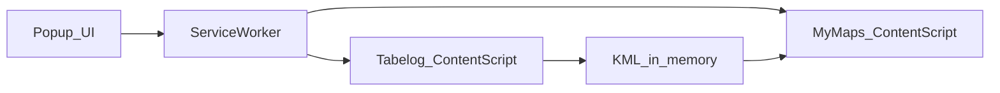

# Chrome Extension Decision Checklist

Inventory of product and engineering decisions for the Manifest V3 + TypeScript extension. Normative accepted choices live in ADRs; this page tracks status and pointers.

## Accepted (do not re-litigate without a new ADR)

| Topic | Decision | Source |
| :--- | :--- | :--- |
| Delivery form | Desktop Chrome Manifest V3 extension, TypeScript → bundled JS | [ADR-0003](adr/0003-chrome-extension-my-maps-web-import.md) |
| Extract source | PC saved-list DOM only (fixed selectors) | [ADR-0003](adr/0003-chrome-extension-my-maps-web-import.md), [extraction spec](../reference/tabelog-pc-saved-list-extraction-spec.md) |
| Fields | name, address, URL; optional short description; URL first line of description; **collections** (`id` + `name`, may be empty) | extraction spec, [ADR-0005](adr/0005-extract-collections-for-future-pin-styling.md) |
| Import path | In-memory KML → My Maps Web UI automation (no Drive API / OAuth tokens) | [ADR-0003](adr/0003-chrome-extension-my-maps-web-import.md) |
| Privacy | User-started only; no credentials, cookies, profile reads; bookmarks JSON allowlists `labels` only | [ADR-0003](adr/0003-chrome-extension-my-maps-web-import.md), [ADR-0005](adr/0005-extract-collections-for-future-pin-styling.md) |
| Failure | Selector/UI/count mismatch → explicit failure; no fake full success | [ADR-0003](adr/0003-chrome-extension-my-maps-web-import.md) |
| Permissions & injection | See ADR-0004 | [ADR-0004](adr/0004-extension-implementation-baseline.md) |
| UX flow & tab premise | Popup-only extract; complete → Next → confirm summary → Import start | [ADR-0004](adr/0004-extension-implementation-baseline.md), [UI spec](../reference/extension-ui-specifications.md), [UI design](extension-ui-design.md) |
| Toolchain & Architecture | WXT framework (`wxt.dev`) + npm + Vitest; Clean Architecture with `entrypoints/` & `src/` | [ADR-0004](adr/0004-extension-implementation-baseline.md), [ADR-0006](adr/0006-wxt-framework-adoption.md), [wxt-architecture](wxt-architecture-design.md), [wxt-entrypoints](../reference/wxt-entrypoints-and-directory-structure.md) |
| Popup UI framework | React via `@wxt-dev/module-react`, popup-only; content scripts/background stay plain TypeScript | [ADR-0007](adr/0007-wxt-react-popup-ui-framework.md) |
| Extracted data handoff | `chrome.storage.session` schema | [ADR-0004](adr/0004-extension-implementation-baseline.md), [session schema](../reference/extension-session-storage-schema.md) |
| Messaging | Typed popup ↔ worker ↔ content protocol | [messaging](../reference/extension-messaging-protocol.md) |
| Error catalog | Stable codes + Japanese UI strings | [error codes](../reference/extension-error-codes.md) |
| KML schema | Placemark + URL-first description; no collection styles in v1 | [kml-data-schema](../reference/kml-data-schema.md) |
| Privacy model | No cookies/tokens/phones/memos | [security-privacy](security-privacy-model.md) |
| Test fixtures & plan | Sanitized HTML under `test/fixtures/tabelog/` + Phase 1 Test Plan | [html-fixture-policy](../reference/html-fixture-policy.md), [test plan](../reference/test-plan-phase1.md) |
| My Maps spike gate | See ADR-0004 | [ADR-0004](adr/0004-extension-implementation-baseline.md) |

## Flow (accepted architecture)

## Open / deferred (change only with ADR or explicit product change)

| Topic | Current default (until revised) |
| :--- | :--- |
| Chrome Web Store listing | Deferred; develop via Load unpacked first |
| Playwright / browser E2E | Deferred; Vitest + sanitized HTML fixtures first |
| KML user download | Not in v1 (memory → My Maps only) |
| Import into existing map | Not in v1 (spike targets **new map** only) |
| **Pin color per collection** | Deferred; extract `collections` / catalog now ([ADR-0005](adr/0005-extract-collections-for-future-pin-styling.md)) |
| Production telemetry | None; no PII in logs |

When closing an open item, add or amend an ADR and update this table.
