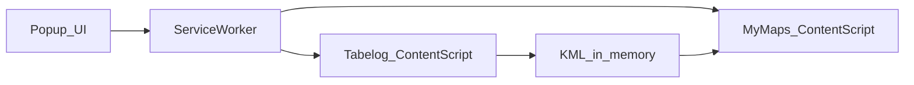

# Chrome Extension Decision Checklist

Inventory of product and engineering decisions for the Manifest V3 + TypeScript extension. Normative accepted choices live in ADRs; this page tracks status and pointers.

## Accepted (do not re-litigate without a new ADR)

| Topic | Decision | Source |
| :--- | :--- | :--- |
| Delivery form | Desktop Chrome Manifest V3 extension, TypeScript → bundled JS | [ADR-0003](adr/0003-chrome-extension-my-maps-web-import.md) |
| Extract source | PC saved-list DOM only (fixed selectors) | [ADR-0003](adr/0003-chrome-extension-my-maps-web-import.md), [extraction spec](../reference/tabelog-pc-saved-list-extraction-spec.md) |
| Fields | name, address, URL; optional short description; URL first line of description | extraction spec / design |
| Import path | In-memory KML → My Maps Web UI automation (no Drive API / OAuth tokens) | [ADR-0003](adr/0003-chrome-extension-my-maps-web-import.md) |
| Privacy | User-started only; no credentials, cookies, profile reads | [ADR-0003](adr/0003-chrome-extension-my-maps-web-import.md) |
| Failure | Selector/UI/count mismatch → explicit failure; no fake full success | [ADR-0003](adr/0003-chrome-extension-my-maps-web-import.md) |
| Permissions & injection | See ADR-0004 | [ADR-0004](adr/0004-extension-implementation-baseline.md) |
| UX flow & tab premise | See ADR-0004 | [ADR-0004](adr/0004-extension-implementation-baseline.md) |
| Toolchain & repo shape | See ADR-0004 | [ADR-0004](adr/0004-extension-implementation-baseline.md) |
| Extracted data handoff | See ADR-0004 | [ADR-0004](adr/0004-extension-implementation-baseline.md) |
| My Maps spike gate | See ADR-0004 | [ADR-0004](adr/0004-extension-implementation-baseline.md) |

## Flow (accepted architecture)

## Open / deferred (change only with ADR or explicit product change)

| Topic | Current default (until revised) |
| :--- | :--- |
| Chrome Web Store listing | Deferred; develop via Load unpacked first |
| Playwright / browser E2E | Deferred; Vitest + sanitized HTML fixtures first |
| KML user download | Not in v1 (memory → My Maps only) |
| Import into existing map | Not in v1 (spike targets **new map** only) |
| Production telemetry | None; no PII in logs |

When closing an open item, add or amend an ADR and update this table.
