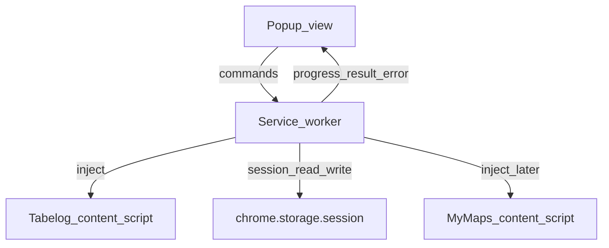

# Design: Extension Popup UI (Extract → Confirm → Import Start)

## Purpose

Explain why the extension uses a **popup-only** stepped flow, how extract completion is an explicit intermediate step, and what the confirm screen summarizes before import starts.

Normative UI rules: [`docs/reference/extension-ui-specifications.md`](../reference/extension-ui-specifications.md)  
Baseline decisions: [`ADR-0004`](adr/0004-extension-implementation-baseline.md)

---

## Context

Users already browse the Tabelog **PC saved list** in a normal Chrome tab. The extension must not invent login or list URLs. ADR-0004 chose a stepped popup (extract → confirm → import) with progress/cancel and explicit errors.

Unresolved product choices were settled for v1 UI as follows:

| Topic | Choice |
| :--- | :--- |
| Extract entry | Popup only (no in-page button) |
| After successful extract | Show completion; user presses **次へ** (no auto-advance) |
| Confirm content | Counts only (shops + collections), plus editable map name |
| Doc scope | Through **My Maps へインポート** button; Maps DOM automation later |

---

## Why popup-only entry

- Avoids fighting Tabelog layout/CSP with a permanent injected bar.
- Matches programmatic content-script injection: nothing runs until **抽出する**.
- Keeps a single chrome for permissions messaging and errors.

Trade-off: the user must discover the extension action; the `wrong_tab` state exists to teach the tab premise without opening pages for them.

---

## Why an explicit `extract_complete` step

Auto-advancing into confirm can hide failures and rush import. A completion screen:

- Makes “full crawl finished” a visible success moment.
- Lets the user **やり直す** before import framing.
- Separates extraction success from “ready to name the map / import”.

Confirm then focuses on **decision** (counts + map name + import), not on re-stating the crawl animation.

---

## Confirm summary (no shop list)

v1 confirm shows:

- Unique shop count  
- Collection kind count = unique ids in `collectionsCatalog` after crawl (`0` if empty) — **confirmed**  
- Map name field (default dated title)

A scrollable shop list was deferred to reduce popup height and privacy surface in the small UI. Collections remain in session data for a **future** pin-color design (ADR-0005) without exposing a color UI yet.

---

## Import button vs Maps automation

The primary **My Maps へインポート** control is in scope so the full happy path is visible in the popup. What happens inside My Maps (selectors, waits, success toast) stays behind the ADR-0004 spike and a future reference doc. The popup only owns: validate name, session handoff, optional host prompt, open/focus a **new-map** My Maps tab, show `import_starting` / errors. Exact Maps URL remains spike detail.

---

## State ownership

UI state (`ready` / `extracting` / …) is derived from worker + session. **Confirmed**: closing the popup during extract does **not** cancel; the worker keeps running and reopening reconnects to progress or the terminal state.

---

## Confirmed product defaults (locked)

| Topic | Decision |
| :--- | :--- |
| Confirm collection count | `collectionsCatalog` unique id count |
| Popup close while extracting | Continue in service worker; reconnect on reopen |
| My Maps URL on import | Deferred to spike; UI only requires open/focus for new map |
