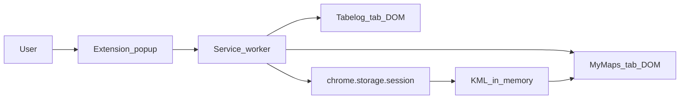

# Security & Privacy Model

Explanation of what the Chrome extension is allowed to read, store, and transmit — and what it must never touch.

Normative companions: [ADR-0003](adr/0003-chrome-extension-my-maps-web-import.md), [ADR-0005](adr/0005-extract-collections-for-future-pin-styling.md), [extraction spec](../reference/tabelog-pc-saved-list-extraction-spec.md), [session schema](../reference/extension-session-storage-schema.md), [error codes](../reference/extension-error-codes.md).

---

## 1. Goals

- Import the user’s own Tabelog **saved-list shops** into **their** My Maps session without the extension handling Google/Tabelog passwords or tokens.
- Minimize data: only what My Maps placement and later (optional) pin styling need.
- Fail closed on selector drift; never “succeed” with a silently truncated list.

---

## 2. Trust boundaries

- Tabelog / My Maps pages run in the user’s browser profile. The extension uses the existing logged-in context via UI automation only.
- The extension **does not** call Drive API, OAuth token endpoints, or `chrome.cookies`.

---

## 3. Allowed reads (Tabelog PC saved list)

| Data | Purpose |
| :--- | :--- |
| Shop name | Placemark `<name>` |
| Shop URL (allowlisted `https://tabelog.com/...`) | Identity + description line 1 |
| Street address (from copy-helper textarea parse) | Placemark `<address>` |
| Optional area/category text | Description line 2+ |
| Collection label `id` + `title` only | Domain `collections` / catalog (future pin color; not in v1 KML styles) |
| List chrome counts / pager controls | Completeness + crawl |

All strings sanitized before session/KML (extraction spec §6).

---

## 4. Explicitly forbidden reads / stores

| Forbidden | Notes |
| :--- | :--- |
| Cookies / `chrome.cookies` | Not in permissions; never request |
| OAuth / access tokens / password fields | Never scrape or store |
| Account email, phone of the **user**, profile photos | Out of product scope |
| Shop **telephone** from copy helper | Parsed only to discard the line |
| `bookmark_comment` / memo / preview fields in `#js-bookmarks-data` | Labels only (ADR-0005) |
| Reviewer identity beyond path detection | Do not persist rvwr ids into KML or UI summaries |
| Payment / T-point / follow-graph data | Ignore |
| Arbitrary page HTML upload to a server | Extension is local-only; no product backend for shop data |

Hidden JSON may be read **only** for allowlisted label fields. Any other key is ignored.

---

## 5. Storage & retention

| Store | Content | Lifetime |
| :--- | :--- | :--- |
| `chrome.storage.session` | Extract result, uiStep, map name, job, last error | Browser session (cleared when session ends) |
| In-memory KML / Blob | Built at import time | Ephemeral |
| `chrome.storage.local` | Not used for shop lists in v1 | — |

No analytics SDK that ships shop payloads. Dev logging may use error **codes** only; not full addresses/names in shared logs.

---

## 6. Permissions posture

- Prefer `optional_host_permissions` for Tabelog and Google Maps / My Maps hosts, requested at extract/import start.
- `storage`, `activeTab`, `scripting` as needed for orchestration.
- Deny → user-visible `HostPermissionDenied`; no silent fallback to broader hosts.
- No `<all_urls>`, no remote code, no `eval`.

---

## 7. My Maps side

- Automate only the Web UI in the user’s authenticated Chrome session.
- Do not read Google account cookies or token storage.
- Unexpected DOM → explicit `MyMapsUiChanged` (or prelude equivalents); never mark partial import as full success.

---

## 8. Threat notes (practical)

| Risk | Mitigation |
| :--- | :--- |
| Injected markup in shop fields | Sanitize + XML escape / CDATA after sanitize |
| Malicious `javascript:` URLs | HTTPS + host/path allowlist |
| Accidental PII in fixtures / commits | [Fixture policy](../reference/html-fixture-policy.md) |
| Over-broad extension review | Keep permission set minimal; document every permission |

---

## 9. User expectations

- Extraction and import run only after explicit button presses.
- Closing the popup during extract does not cancel (reconnect); cancel is an explicit control.
- The extension will not open a saved-list URL by fabricating reviewer ids.
