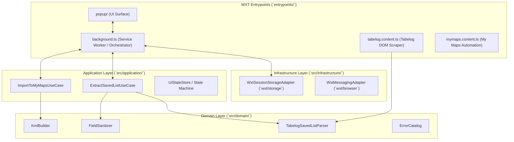

# WXT Extension Architecture & Design Specification

Normative architecture and module design for the **import2gmap Chrome Extension** using **WXT** (Next-gen Web Extension Framework), Vite, TypeScript, and Vitest.

Related: [ADR-0004](adr/0004-extension-implementation-baseline.md), [ADR-0006](adr/0006-wxt-framework-adoption.md), [decision checklist](chrome-extension-decision-checklist.md).

---

## 1. High-Level Architecture

The extension follows a **Clean Architecture / DDD** layout wrapped inside WXT's entrypoint model. 



---

## 2. Directory & Component Layout

```text
import2gmap/
├── wxt.config.ts                # WXT framework & Manifest V3 configuration
├── package.json
├── tsconfig.json
├── entrypoints/                 # WXT Entrypoints (thin adapters)
│   ├── popup/
│   │   ├── index.html           # Popup HTML
│   │   └── main.ts              # Popup UI mount & event listeners
│   ├── background.ts            # Service worker orchestrator (defineBackground)
│   ├── tabelog.content.ts       # Tabelog DOM scraper script (defineContentScript)
│   └── mymaps.content.ts        # My Maps Web UI script (defineContentScript)
├── src/                         # Pure TypeScript core logic
│   ├── domain/
│   │   ├── models/              # ExtractedShop, CollectionRef, ExtractedSavedList
│   │   ├── parser/              # TabelogSavedListParser, AddressParser
│   │   ├── sanitizer/           # FieldSanitizer (NFKC, HTML strip, max-length truncate)
│   │   ├── kml/                 # KmlBuilder (OGC KML 2.2 generator)
│   │   └── errors/              # ExtensionError definitions
│   ├── application/
│   │   ├── extract-use-case.ts  # Multi-page crawl orchestration logic
│   │   ├── ui-state-store.ts    # UI step state machine & reducers
│   │   └── import-use-case.ts   # Prelude / Maps import orchestration
│   └── infrastructure/
│       ├── storage/             # WXT Storage wrapper (`wxt/storage`)
│       └── messaging/           # Typed WXT messaging adapters
└── test/
    └── fixtures/
        └── tabelog/             # Sanitized HTML fixtures
```

---

## 3. WXT Entrypoint Definitions

### 3.1 `wxt.config.ts`

Defines Manifest V3 metadata, permissions, optional host permissions, and build configuration:

```ts
import { defineConfig } from 'wxt';

export default defineConfig({
  manifest: {
    name: 'import2gmap',
    description: '食べログの保存リストをGoogleマイマップへ自動インポートするChrome拡張機能',
    version: '1.0.0',
    permissions: ['storage', 'activeTab', 'scripting'],
    optional_host_permissions: [
      'https://tabelog.com/*',
      'https://www.google.com/maps/*',
    ],
    action: {
      default_title: '保存リストを取り込む',
    },
  },
  vite: () => ({
    // Vite / Vitest configuration
  }),
});
```

### 3.2 `entrypoints/background.ts`

Applies `defineBackground` to initialize message handlers and orchestrate jobs:

```ts
import { defineBackground } from 'wxt/sandbox';

export default defineBackground(() => {
  // Listen for popup messages, manage session storage, executeScript when requested
});
```

### 3.3 `entrypoints/tabelog.content.ts`

Applies `defineContentScript` for programmatic or matched script execution:

```ts
import { defineContentScript } from 'wxt/sandbox';

export default defineContentScript({
  matches: ['https://tabelog.com/*'],
  registration: 'runtime', // injected via chrome.scripting on user demand
  main() {
    // Listens for TAB_EXTRACT_PAGE, runs TabelogSavedListParser, returns page results
  },
});
```

---

## 4. Storage & Handoff via `wxt/storage`

- Storage operations use WXT's `storage` API scoped to `session` area:
  - Key: `session:import2gmap`
- **WXT Storage Usage**:
  ```ts
  import { storage } from 'wxt/storage';

  export const saveExtractResult = async (result: StoredExtractResult) => {
    await storage.setItem('session:import2gmap', {
      schemaVersion: 1,
      uiStep: 'extract_complete',
      extractResult: result,
    });
  };
  ```
- **Atomicity**: Written only after a complete, successful crawl.
- **Privacy & Cleanup**: Automatically cleared when the browser session ends or user explicitly triggers **やり直す** (`EXTRACT_DISCARD`).

---

## 5. Typed Messaging via `wxt/browser`

- Uses standard `browser.runtime.sendMessage` / `browser.tabs.sendMessage` wrapped in type guards.
- All messages include `protocolVersion: 1` and `type` discriminator.
- Service worker acts as the sole router between popup and content scripts.

---

## 6. Testing Strategy with WXT & Vitest

- **Pure Domain & Use Case Testing**:
  - Test `TabelogSavedListParser`, `FieldSanitizer`, `KmlBuilder`, and `UiStateStore` in Vitest.
  - Load HTML fixtures from `test/fixtures/tabelog/` into JSDOM / Happy-DOM.
- **WXT Entrypoint Testing**:
  - Entrypoints are thin wrappers that delegate directly to tested domain modules.
  - Mock `wxt/storage` and `wxt/browser` at the infrastructure boundary.
