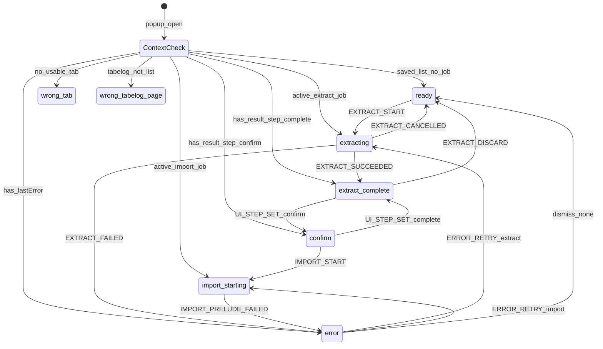
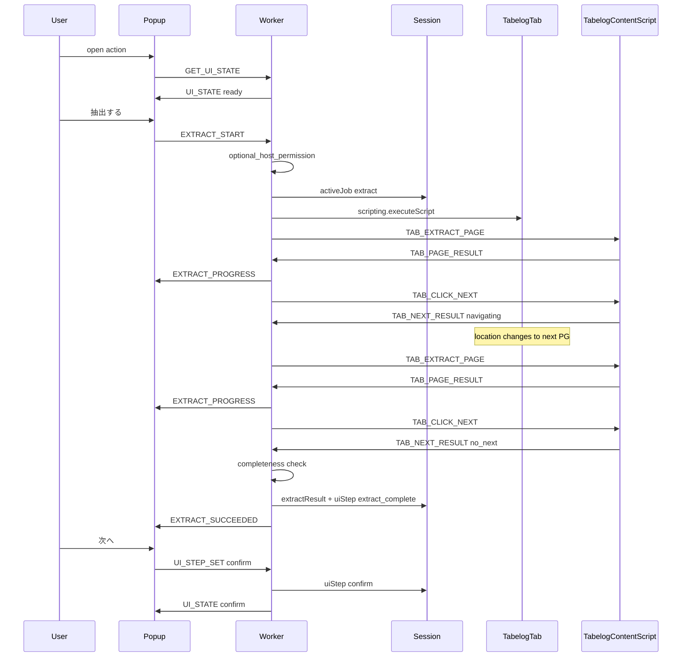
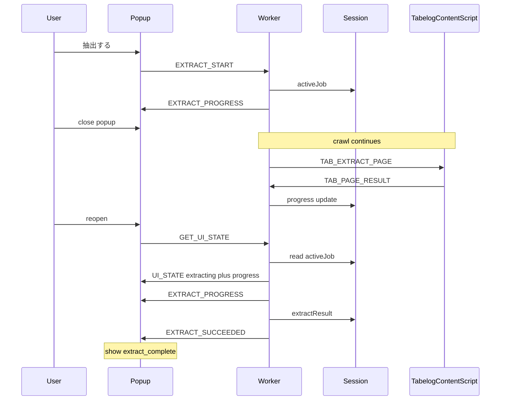
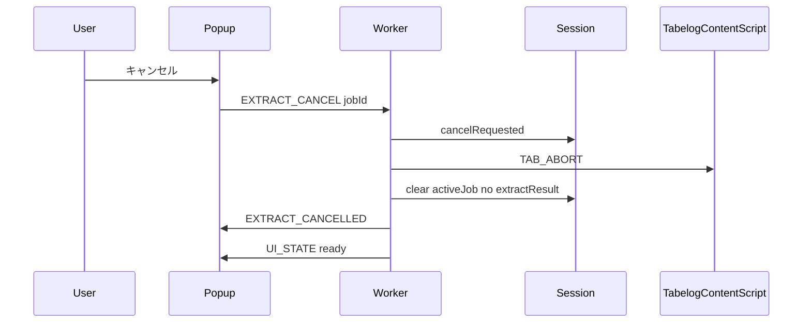
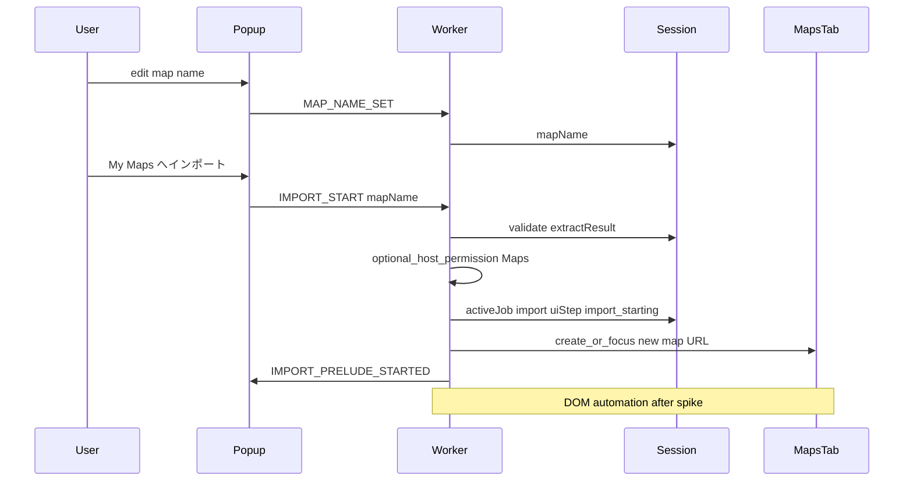
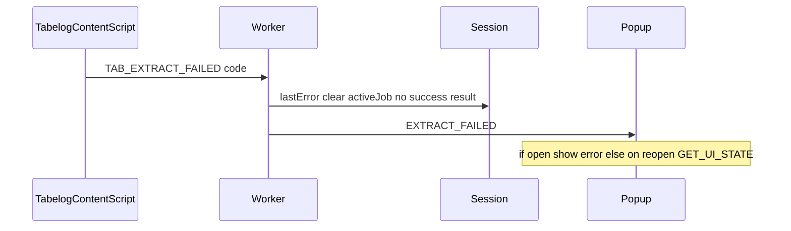

# Extension Extract → Confirm Sequences

Reference sequences and state diagrams for popup extract/confirm, including **reconnect after popup close** during extract.

Related: [UI spec](extension-ui-specifications.md), [messaging](extension-messaging-protocol.md), [session schema](extension-session-storage-schema.md), [error codes](extension-error-codes.md).

---

## 1. UI step state machine

---

## 2. Happy path — extract through confirm

---

## 3. Popup close during extract — reconnect

**Rule (confirmed):** closing the popup does **not** cancel extract. The worker keeps the job; reopen resyncs.

If the job failed while the popup was closed, reopen yields `UI_STATE` with `uiStep: error` and `lastError`.

---

## 4. Cancel extract

No partial `extractResult` is published.

---

## 5. Confirm → import start (prelude only)

---

## 6. Failure while extracting

---

## 7. Implementation notes

- Progress events may arrive with no popup listener; that is OK. Session `activeJob.progress` is the reconnect source of truth.
- After navigation (`TAB_NEXT_RESULT navigating`), worker waits for tab `status complete` (or equivalent) before `TAB_EXTRACT_PAGE` again; timeout → `ExtractTimeout` / `TabNavigatedAway` as appropriate.
- Completeness uses extraction spec rules; failure → `IncompleteCrawl`.
