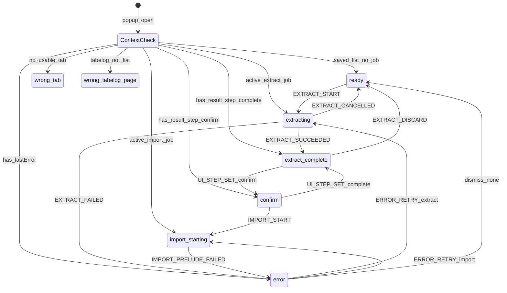
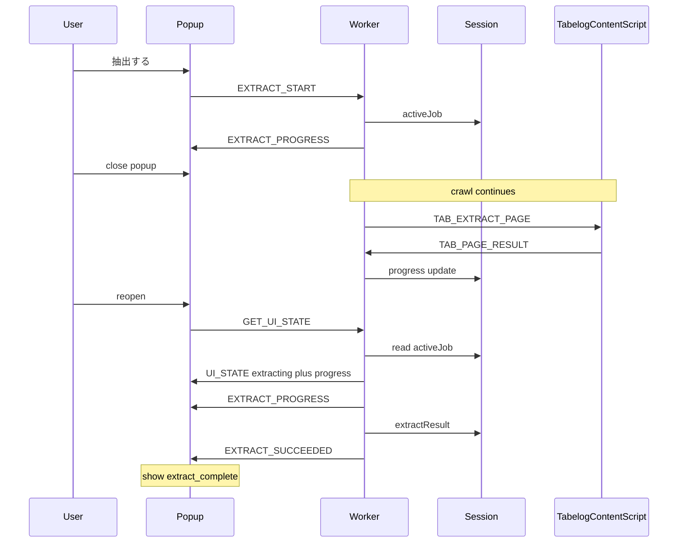
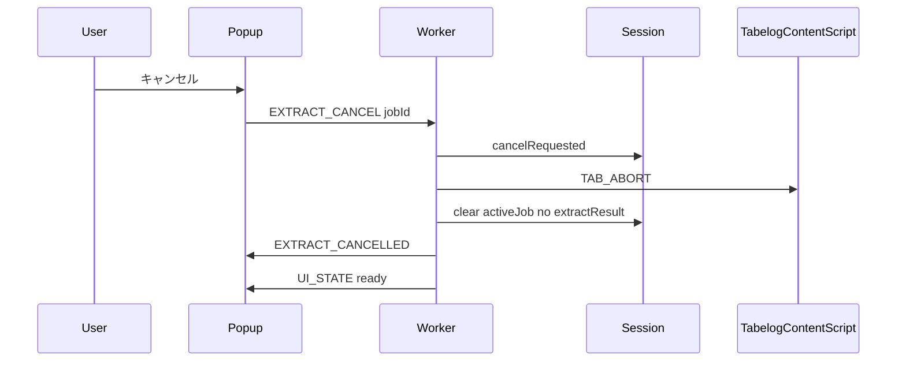
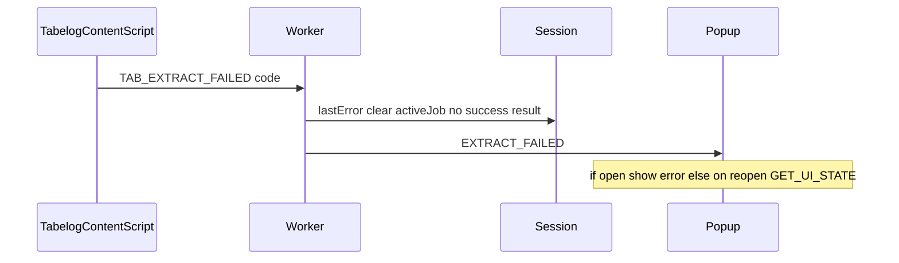

# Extension Extract → Confirm Sequences

Reference sequences and state diagrams for popup extract/confirm, including **reconnect after popup close** during extract.

Related: [UI spec](extension-ui-specifications.md), [messaging](extension-messaging-protocol.md), [session schema](extension-session-storage-schema.md), [error codes](extension-error-codes.md).

---

## 1. UI step state machine



---

## 2. Happy path — extract through confirm

```mermaid
sequenceDiagram
  participant User
  participant Popup
  participant Worker
  participant Session
  participant Tab as TabelogTab
  participant CS as TabelogContentScript

  User->>Popup: open action
  Popup->>Worker: GET_UI_STATE
  Worker->>Popup: UI_STATE ready
  User->>Popup: 抽出する
  Popup->>Worker: PERMISSION_REQUEST_PENDING step=extract
  Note over Popup,Worker: awaited — write must land before the dialog can kill the popup
  Popup->>Popup: browser.permissions.request (Chrome dialog; popup context destroyed if shown)
  Popup->>Worker: EXTRACT_START
  Worker->>Session: activeJob extract
  Worker->>Tab: scripting.executeScript
  Worker->>CS: TAB_EXTRACT_PAGE
  CS->>Worker: TAB_PAGE_RESULT
  Worker->>Popup: EXTRACT_PROGRESS
  Worker->>CS: TAB_CLICK_NEXT
  CS->>Worker: TAB_NEXT_RESULT navigating
  Note over Tab: location changes to next PG
  Worker->>CS: TAB_EXTRACT_PAGE
  CS->>Worker: TAB_PAGE_RESULT
  Worker->>Popup: EXTRACT_PROGRESS
  Worker->>CS: TAB_CLICK_NEXT
  CS->>Worker: TAB_NEXT_RESULT no_next
  Worker->>Worker: completeness check
  Worker->>Session: extractResult + uiStep extract_complete
  Worker->>Popup: EXTRACT_SUCCEEDED
  User->>Popup: 次へ
  Popup->>Worker: UI_STEP_SET confirm
  Worker->>Session: uiStep confirm
  Worker->>Popup: UI_STATE confirm
```

---

## 3. Popup close during extract — reconnect

**Rule (confirmed):** closing the popup does **not** cancel extract. The worker keeps the job; reopen resyncs.



If the job failed while the popup was closed, reopen yields `UI_STATE` with `uiStep: error` and `lastError`.

---

## 4. Cancel extract



No partial `extractResult` is published.

---

## 5. Confirm → import start (prelude only)

```mermaid
sequenceDiagram
  participant User
  participant Popup
  participant Worker
  participant Session
  participant MapsTab

  User->>Popup: edit map name
  Popup->>Worker: MAP_NAME_SET
  Worker->>Session: mapName
  User->>Popup: My Maps へインポート
  Popup->>Worker: PERMISSION_REQUEST_PENDING step=import mapName
  Note over Popup,Worker: awaited — write must land before the dialog can kill the popup
  Popup->>Popup: browser.permissions.request Maps (Chrome dialog; popup context destroyed if shown)
  Popup->>Worker: IMPORT_START mapName
  Worker->>Session: validate extractResult
  Worker->>Session: activeJob import uiStep import_starting
  Worker->>MapsTab: create_or_focus new map URL
  Worker->>Popup: IMPORT_PRELUDE_STARTED
  Note over Worker,MapsTab: DOM automation after spike
```

---

## 6. Failure while extracting



---

## 7. Permission prompt kills the popup — worker resume (added 2026-08-04)

**Bug this fixes**: Chrome's optional-host-permission dialog takes focus and destroys the popup's
execution context. The popup's `await browser.permissions.request(...)` continuation (sending
`EXTRACT_START`) never ran once the dialog appeared, so nothing happened until the user pressed
**抽出する** a second time. Same bug for **My Maps へインポート**. Fix: the worker resumes the step
itself from `permissions.onAdded`, since it survives the popup's death. See
[messaging protocol §7](extension-messaging-protocol.md#7-worker-permission-prompt-resume-permissionsonadded--added-2026-08-04),
[session schema §5a](extension-session-storage-schema.md#5a-pending-permission-added-2026-08-04).

```mermaid
sequenceDiagram
  participant User
  participant Popup
  participant Worker
  participant Session
  participant Tab as TabelogTab

  User->>Popup: 抽出する
  Popup->>Worker: PERMISSION_REQUEST_PENDING step=extract
  Worker->>Session: pendingPermission
  Worker->>Popup: (ack)
  Popup->>Popup: browser.permissions.request
  Note over Popup: Chrome shows the dialog; popup destroyed
  User->>Popup: grants permission (Chrome UI, not the extension popup)
  Note over Worker: permissions.onAdded fires
  Worker->>Worker: permissions.contains(required origins)? yes
  Worker->>Worker: getActiveTab + detectTabContext
  Worker->>Worker: routePermissionGranted(pendingPermission, tabContext)
  Worker->>Session: activeJob extract, pendingPermission cleared
  Worker->>Tab: scripting.executeScript (same as a normal EXTRACT_START)
  User->>Popup: reopen
  Popup->>Worker: GET_UI_STATE
  Worker->>Popup: UI_STATE extracting
  Note over Popup: shows progress immediately — no second press needed
```

If the active tab is no longer the Tabelog saved list by the time `permissions.onAdded` fires,
the worker does **not** silently do nothing — it writes an explicit `error` (`NotSavedListPage` /
`WrongTab`) so the user sees why extraction didn't resume, same as any other extract failure.

If the popup happens to survive the prompt (permission already granted, no dialog shown), its own
`EXTRACT_START` runs instead; both paths are idempotent (a job already active for that step makes
either path a no-op) and both clear `pendingPermission`.

---

## 8. Implementation notes

- Progress events may arrive with no popup listener; that is OK. Session `activeJob.progress` is the reconnect source of truth.
- After navigation (`TAB_NEXT_RESULT navigating`), worker waits for tab `status complete` (or equivalent) before `TAB_EXTRACT_PAGE` again; timeout → `ExtractTimeout` / `TabNavigatedAway` as appropriate.
- Completeness uses extraction spec rules; failure → `IncompleteCrawl`.
