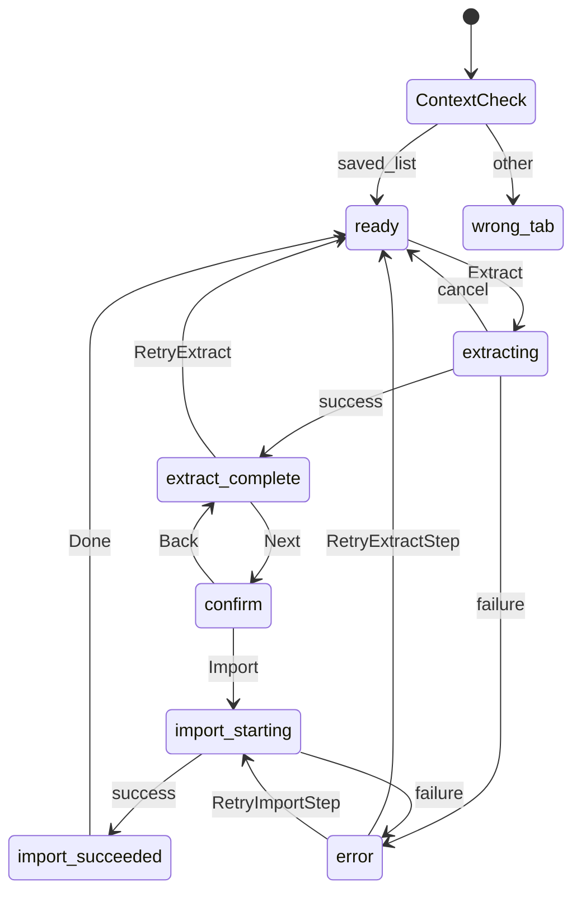

# Extension UI Specification (Popup Flow)

Reference for the Manifest V3 **action popup** UI: extract from the Tabelog PC saved list, confirm summary, and start import.

Normative product defaults: [ADR-0004](../explanation/adr/0004-extension-implementation-baseline.md).  
Extraction field rules: [tabelog-pc-saved-list-extraction-spec.md](tabelog-pc-saved-list-extraction-spec.md).  
Design rationale: [extension-ui-design.md](../explanation/extension-ui-design.md).  
Messaging / session / errors / sequences: [messaging](extension-messaging-protocol.md), [session](extension-session-storage-schema.md), [errors](extension-error-codes.md), [sequences](extension-extract-confirm-sequences.md).

**v1 entry point**: popup only. Do **not** inject an extract button or toolbar into the Tabelog page.

**Scope of this document**: screens and transitions through the **Import** primary action. My Maps DOM automation after that action is specified elsewhere / gated by the ADR-0004 spike.

---

## 1. Surfaces

| Surface | Role |
| :--- | :--- |
| Toolbar action popup | Sole user UI for extract → complete → confirm → import start |
| Service worker | Orchestration, `chrome.storage.session`, scripting, optional host prompts |
| Tabelog content script | Injected only after user starts extract (no persistent page chrome) |
| My Maps content script | Injected only after user starts import (details out of scope here) |

Popup copy is **Japanese** unless a future i18n ADR says otherwise.

---

## 2. Context Detection (on popup open)

When the popup opens, the service worker (or popup via messaging) evaluates the **active tab**:

| Condition | UI state id |
| :--- | :--- |
| Active tab matches PC saved-list detection ([extraction spec §2](tabelog-pc-saved-list-extraction-spec.md)) | `ready` |
| Active tab is Tabelog but not saved-list | `wrong_tabelog_page` |
| Active tab is not Tabelog / unreachable / no tab | `wrong_tab` |
| Session already has a successful extract for this browser session | May offer resume (Section 6) |

Detection failure must not scrape the page.

**Implementation note (no injection on popup open)**: this context check uses only `tab.url` pattern matching — host `tabelog.com`/`www.tabelog.com` and path `/rvwr/{rvwrId}/hozon_restaurants/list` ([extraction spec §2](tabelog-pc-saved-list-extraction-spec.md), steps 1–2). It does **not** inject a content script or read page DOM chrome (steps 3–4 of that section) just to render the popup. The full DOM chrome check remains the content script's job at extract time; a URL match that turns out not to be a real saved-list page fails there with `NotSavedListPage` (see [error codes](extension-error-codes.md)).

---

## 3. Screens & Elements

Screen ids are stable for tests and analytics-free logging.

### 3.1 `ready` — 抽出待機

Shown when context is saved-list and no extract is running.

| Element | Type | Rules |
| :--- | :--- | :--- |
| Title | text | 製品名または「保存リストを取り込む」 |
| Status | text | 保存リストページを認識した旨 |
| **抽出する** | primary button | Starts extract flow (Section 4) |
| Hint | text | 全ページを巡回する／明示操作のみ、程度の短文 |

### 3.2 `wrong_tab` / `wrong_tabelog_page` — 抽出不可

| Element | Type | Rules |
| :--- | :--- | :--- |
| Message | text | PC版「保存リスト」を開いてから再実行するよう案内 |
| **抽出する** | primary button | **Disabled** |
| Optional link text | text | 保存リストの開き方はユーザー操作任せ（拡張は URL を捏造して開かない） |

### 3.3 `extracting` — 抽出中

Entered immediately after **抽出する** (after optional-host grant if needed).

| Element | Type | Rules |
| :--- | :--- | :--- |
| Progress | text or determinate bar | At least: current page / known total pages **or** shops collected so far; if total unknown, show collected count only |
| Status | text | 「抽出しています…」 |
| **キャンセル** | secondary button | Sends cancel; transitions to `extract_cancelled` or back to `ready` with no session write of partial success |

Partial lists must **not** be stored as a successful extract (ADR-0003). On cancel: clear in-flight work; do not advance to confirm.

### 3.4 `extract_complete` — 抽出完了（中間）

Entered only after a **full successful** crawl (completeness rules in extraction spec).

| Element | Type | Rules |
| :--- | :--- | :--- |
| Result | text | 例: 「{n} 件の店舗を抽出しました」 |
| Optional subline | text | コレクション種類数があれば「コレクション {c} 種類」程度（詳細リストは出さない） |
| **次へ** | primary button | → `confirm` |
| **やり直す** | secondary button | Clears this result from session (or marks superseded) and returns to `ready` (active tab still must be valid to extract again) |

Do **not** auto-advance to `confirm`.

### 3.5 `confirm` — 確認（要約）

| Element | Type | Rules |
| :--- | :--- | :--- |
| Shop count | text | Unique shop count from session |
| Collection count | text | **Unique ids in `collectionsCatalog` after crawl** (`0` if empty). Do not use distinct-on-shops as the displayed count. |
| Map name | text input | Default `食べログ保存リスト YYYY-MM-DD` (local date); user-editable; required non-empty after sanitize |
| **My Maps へインポート** | primary button | Starts import prelude (Section 5) |
| **戻る** | secondary button | → `extract_complete` (session data retained) |

Do **not** show a scrollable shop-name list on this screen (v1).

Pin-color / per-collection styling controls are **not** shown (deferred; ADR-0005).

### 3.6 `import_starting` — インポート開始中

Entered after **My Maps へインポート**.

| Element | Type | Rules |
| :--- | :--- | :--- |
| Status | text | 権限確認・My Maps タブ準備中である旨 |
| **キャンセル** | secondary | Best-effort cancel before DOM automation commits; if automation already past the point of no return, show explicit failure instead of silent success |

Detailed My Maps step UI (progress inside Maps) may replace this screen in a later spec; v1 only requires this gate + handoff.

### 3.6b `import_succeeded` — インポート完了

Entered once the My Maps content script confirms the KML import succeeded (see [messaging protocol §6](extension-messaging-protocol.md#6-service-worker--my-maps-content-script)).

| Element | Type | Rules |
| :--- | :--- | :--- |
| Result | text | 例:「{mapName} に {shopCount} 件の店舗をインポートしました」 |
| **完了** | primary button | Sends `EXTRACT_DISCARD`; clears the session extract payload and returns to `ready` |

The My Maps document itself is renamed to `mapName` as part of the import automation, before the KML import step runs (see [messaging protocol §6](extension-messaging-protocol.md#6-service-worker--my-maps-content-script) and [spike results §2b](../explanation/my-maps-import-spike-results.md)) — the map does **not** keep Google's default title after a successful import. A rename failure is treated as an explicit import failure (`error` screen), not a silent partial success, since this screen's text asserts the map name.

### 3.7 `error` — エラー

| Element | Type | Rules |
| :--- | :--- | :--- |
| Error code | text | Stable code (e.g. `NotSavedListPage`, `IncompleteCrawl`, `HostPermissionDenied`) |
| Message | text | Short Japanese explanation |
| **再試行** | primary | Retries the **failed step** only (extract **or** import start) |
| **閉じる相当** | secondary | → `ready` or last safe screen without marking success |

---

## 4. Extract Transition Table

```text
wrong_* --(open popup on saved list)--> ready
ready --[抽出する]--> (optional host permission)
  -- granted --> extracting
  -- denied --> error(HostPermissionDenied)
extracting -- progress events --> extracting
extracting --[キャンセル]--> ready   // no successful session payload
extracting -- success --> extract_complete
extracting -- failure --> error
extract_complete --[次へ]--> confirm
extract_complete --[やり直す]--> ready
confirm --[戻る]--> extract_complete
confirm --[My Maps へインポート]--> import_starting
import_starting -- success --> import_succeeded
import_starting -- failure --> error
import_succeeded --[完了]--> ready
error --[再試行]--> ready | extracting | import_starting  // depending on failed step
```



---

## 5. Import Primary Action (UI contract only)

On **My Maps へインポート**:

1. Validate map name (non-empty, sanitized plain text; max length e.g. 80).
2. Persist map name with session extract payload.
3. Request My Maps optional host permission if not granted → deny → `error(HostPermissionDenied)`.
4. Open or focus a My Maps Web UI tab suitable for **new map** creation (exact URL is an implementation detail; must not require the extension to handle Google login UI).
5. Hand off to My Maps content-script automation. Popup shows `import_starting` while the worker drives the Maps tab, then `import_succeeded` (Section 3.6b) or `error` once the automation reports its result.

This document does **not** specify Maps DOM selectors — see [spike results](../explanation/my-maps-import-spike-results.md) for those.

---

## 6. Session & Popup Lifecycle

- Successful extract payload lives in `chrome.storage.session` ([ADR-0004](../explanation/adr/0004-extension-implementation-baseline.md)).
- Closing the popup during `extracting` does **not** cancel. The service worker **keeps extract running**; reopening the popup reconnects to `extracting` or the terminal state (`extract_complete` / `error`).
- Reopening popup with a successful unused extract: show `extract_complete` (or `confirm` if user had already moved next — persist a `uiStep` in session).
- Cancelled or failed extracts must not leave a “successful” payload available to import.

---

## 7. Permissions UX

- First **抽出する** may trigger `optional_host_permissions` for Tabelog hosts.
- First **My Maps へインポート** may trigger optional hosts for Google Maps / My Maps.
- Explain in short status text that site access is needed for that step; no custom HTML permission page required beyond Chrome’s prompt.

**Chrome's permission prompt closes the popup — added 2026-08-04.** Chrome's native
optional-host-permission confirmation dialog takes focus, which closes the extension popup and
destroys its JS execution context. The popup cannot rely on anything it does *after* `await`ing
`browser.permissions.request(...)` — that continuation never runs once the dialog appears. To
avoid making the user press **抽出する** / **My Maps へインポート** a second time after granting:

- The popup records the pending step in session storage (`pendingPermission`; see
  [session schema §5a](extension-session-storage-schema.md#5a-pending-permission-added-2026-08-04))
  and awaits the write completing **before** calling `permissions.request()`.
- The service worker — which survives the popup's death — resumes the step itself from
  `browser.permissions.onAdded` once the grant lands (see
  [messaging protocol §7](extension-messaging-protocol.md#7-worker-permission-prompt-resume-permissionsonadded--added-2026-08-04)).
- No new screen id is introduced for this. Reopening the popup after granting the permission
  simply lands on the existing `extracting` / `import_starting` screen (Sections 3.3 / 3.6) — the
  same screens already shown when the popup survives the prompt — so the user sees progress or
  the in-flight state instead of a frozen `ready`/`confirm` screen that needs a second press.
- If the active tab is no longer the Tabelog saved list by the time the worker resumes an extract
  intent, it surfaces the existing `error` screen (Section 3.7) with `NotSavedListPage` or
  `WrongTab` — never a silent no-op.

---

## 8. Non-goals (v1 UI)

- In-page extract button / floating bar on Tabelog
- Shop list / per-row edit on confirm
- Collection color picker
- KML download button
- Opening saved-list URL automatically for the user
- Auto-advance from `extract_complete` to `confirm`

---

## 9. Test Expectations

- Unit-test pure UI state reducers: context → enabled/disabled Extract; extract success → `extract_complete` not `confirm`; Next → `confirm`; summary fields only.
- No dependency on live Tabelog pages for reducer tests.
