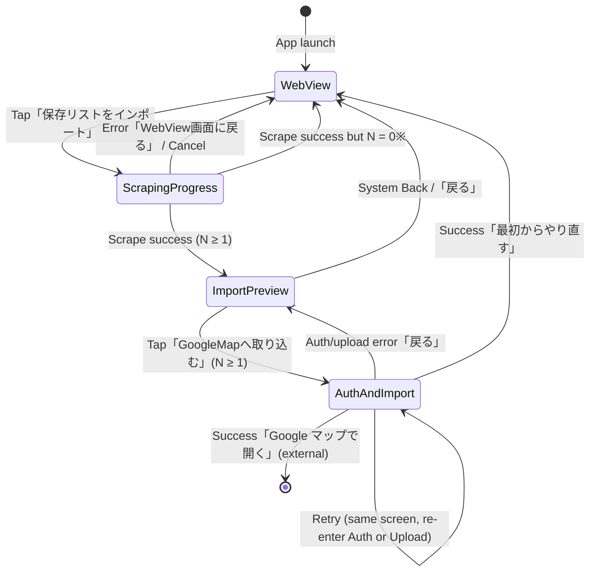

# Screen Composition Specifications

Detailed layout, UI states, copy, transitions, and interaction rules for each screen in **import2gmap**.

Companion overview: [`screen-specifications.md`](./screen-specifications.md)  
Data contract: [`sequence-and-data-flow.md`](./sequence-and-data-flow.md) §2.1 (店舗名 / 住所 / 食べログ URL only)

---

## 0. Global Rules

### 0.1. Navigation Graph



※ 0件成功はエラー扱いとし、明示メッセージのうえ WebView に戻す（空プレビューは出さない）。

### 0.2. Shared UI Policies

| Topic | Decision |
| :--- | :--- |
| Display / export fields | 店舗名 (`name`), 住所 (`address`), 食べログ URL (`url`) only |
| Personal / account data | Never show or scrape (nickname, rvwr id, profile, points, CSRF, etc.) |
| Silent fallbacks | Forbidden (ADR-0002). Always show explicit error + recovery actions |
| Theme | Material 3, light/dark system default |
| Orientation | Portrait primary; landscape keeps same regions with weight adjustment |
| Double-tap | Primary actions disabled while in-flight (`isProcessing == true`) |
| System Back | Pops to previous screen in graph; on WebView root → finish Activity (confirm not required in v1) |
| URL display | Full URL in data model; UI may ellipsize middle (`https://…tabelog.com/…/{rst-id}/`) |
| URL tap (in-app preview) | Opens external browser / Custom Tabs to Tabelog shop page |
| Maps open (success) | Opens returned My Maps / Drive map URL via `ACTION_VIEW` |

### 0.3. Screen IDs

| ID | Composable / Route | Role |
| :--- | :--- | :--- |
| S1 | `TabelogWebViewScreen` | Login + navigate to saved list |
| S2 | `ScrapingProgressScreen` | Multi-page scrape progress / error |
| S3 | `ImportPreviewScreen` | Review extracted shops |
| S4 | `GoogleAuthAndImportScreen` | OAuth + KML upload + result |

---

## 1. S1 — Tabelog WebView Screen (`TabelogWebViewScreen`)

### 1.1. Purpose

User logs into Tabelog in an in-app WebView, opens their 保存リスト, then starts import.

### 1.2. Layout (portrait)

```
┌──────────────────────────────────────┐
│ [Prompt Banner]           (fixed)    │  ~48–72 dp height, multi-line OK
├──────────────────────────────────────┤
│                                      │
│         WebView (weight ≈ 1f)        │  ~70–75% remaining height
│                                      │
│   optional top loading hairline      │
├──────────────────────────────────────┤
│ [Primary CTA bar]         (fixed)    │  ~72–88 dp + system nav inset
│  「保存リストをインポート」            │
└──────────────────────────────────────┘
```

| Region | Spec |
| :--- | :--- |
| Prompt Banner | Always visible while on S1. Background: secondary container; text: on-secondary-container |
| WebView | Initial URL `https://s.tabelog.com/`. Mobile User-Agent. JS + DOM storage enabled for login. Cookie/session stay in WebView only (not copied to app DB). User navigates to 保存リスト unaided. |
| Loading indicator | Linear progress at top of WebView while `WebView` is loading a page |
| CTA bar | Full-width primary button; safe-area padding |

### 1.3. UI States

| State | Banner | WebView | CTA |
| :--- | :--- | :--- | :--- |
| `Browsing` | Shown | Interactive | Enabled |
| `PageLoading` | Shown | May be partial | Enabled (tap starts validation on current DOM when load finishes; if mid-load, queue until `onPageFinished`) |
| `ImportStarting` | Shown | Interaction temporarily blocked (scrim optional) | Disabled + progress on button |

No separate “saved list detected” badge in v1 (validation runs on CTA tap).

### 1.4. Copy

| Element | Text |
| :--- | :--- |
| Banner | `食べログにログイン後、保存リスト（お気に入り）画面を開いてから【保存リストをインポート】ボタンを押してください。` |
| CTA | `保存リストをインポート` |

### 1.5. Interactions

| Action | Behavior |
| :--- | :--- |
| Tap CTA | Validate current URL/DOM is saved-list page → navigate to S2 and start scrape. If invalid → stay on S1, show error dialog (see §1.6) |
| WebView back (gesture / in-page) | WebView history first; if no history → Activity finish |
| App bar | None in v1 (system status bar only) |

### 1.6. Errors (stay on S1)

| Case | Presentation | Actions |
| :--- | :--- | :--- |
| Not a saved-list page | Modal | `OK` (dismiss) |
| Message | `保存リスト画面が検出できませんでした。食べログの「お気に入り/保存リスト」画面を開いた状態でもう一度お試しください。` | |

### 1.7. Out of scope on S1

- Showing scraped counts on this screen  
- Export button  
- Account/profile chrome from Tabelog mirrored in native UI  

---

## 2. S2 — Scraping Progress Screen (`ScrapingProgressScreen`)

### 2.1. Purpose

Run multi-page DOM extraction; show progress or an explicit failure. On success with `N ≥ 1`, go to S3.

### 2.2. Layout

Full-screen dedicated route (not a bottom sheet overlay).

```
┌──────────────────────────────────────┐
│ Title: 保存リストを取得中              │
├──────────────────────────────────────┤
│                                      │
│     Circular / Linear Progress       │
│                                      │
│     Status text (multi-line)         │
│     Optional: current page / count   │
│                                      │
├──────────────────────────────────────┤
│ [キャンセル]              (text btn) │
└──────────────────────────────────────┘
```

Error layout replaces center content with message + actions (same chrome).

### 2.3. UI States

| State | Content | Footer |
| :--- | :--- | :--- |
| `Running` | Progress + status | `キャンセル` enabled |
| `Cancelling` | Progress + `キャンセルしています…` | `キャンセル` disabled |
| `Failed` | Error icon + message | `再試行` (primary), `WebView画面に戻る` (text) |
| `Succeeded` | Brief success then auto-navigate (≤300 ms, no dedicated success UI required) | — |

### 2.4. Progress copy

Template:

`データを取得中... ( {phaseDetail} - {parsedCount}件の店舗をパース済み )`

`phaseDetail` examples:
- List crawl: `追加読み込み {loadMoreCount} 回目`
- Address enrichment: `住所取得 {enriched} / {total}`

Rules:

- `parsedCount` = unique shops aggregated so far (url key)
- Crawl must continue until load-more is exhausted (no early success)

### 2.5. Interactions

| Action | Behavior |
| :--- | :--- |
| `キャンセル` | Stop pagination ASAP; discard partial list; return to S1 |
| `再試行` | Restart scrape from the WebView’s current saved-list page (still on S2 → `Running`) |
| `WebView画面に戻る` | Pop to S1 |
| System Back while `Running` | Same as `キャンセル` |
| System Back while `Failed` | Same as `WebView画面に戻る` |

### 2.6. Error messages

| Case | Message |
| :--- | :--- |
| Not saved-list (race) | `保存リスト画面が検出できませんでした。食べログの「お気に入り/保存リスト」画面を開いた状態でもう一度お試しください。` |
| DOM parse mismatch | `店舗情報の解析に失敗しました。食べログの表示フォーマットが変更された可能性があります。` |
| Network | `通信エラーが発生しました。インターネット接続を確認して再試行してください。` |
| Zero shops after full crawl | `保存リストから店舗を取得できませんでした。リストに店舗があるか確認して再試行してください。` |

No silent continue with empty data.

### 2.7. Extracted payload (for handoff to S3)

Per shop: `name`, `address`, `url` only. Hardcoded DOM rules: [`tabelog-scraping-extraction-spec.md`](./tabelog-scraping-extraction-spec.md).

---

## 3. S3 — Import Preview Screen (`ImportPreviewScreen`)

### 3.1. Purpose

Let the user review extracted shops before Google OAuth / My Maps upload.

### 3.2. Layout

```
┌──────────────────────────────────────┐
│ ← 戻る     抽出プレビュー              │  Top app bar
├──────────────────────────────────────┐
│ Summary bar (fixed)                  │
│ 全 {N} 件の店舗データを抽出しました     │
├──────────────────────────────────────┤
│ LazyColumn                           │
│  ┌────────────────────────────────┐  │
│  │ 店舗名 (1–2 lines, ellipsis)   │  │
│  │ 住所 (1–2 lines)               │  │
│  │ URL (1 line, middle ellipsis)  │  │  ← tappable
│  └────────────────────────────────┘  │
│  ...                                 │
├──────────────────────────────────────┤
│ [GoogleMapへ取り込む]     (primary)  │  Fixed bottom CTA
└──────────────────────────────────────┘
```

List item is a simple column block (not a heavy card chrome). Divider between items.

### 3.3. UI States

| State | Behavior |
| :--- | :--- |
| `Ready` (`N ≥ 1`) | List + CTA enabled |
| (Entry with `N = 0`) | Must not occur; S2 handles as error |

No edit/delete of individual rows in v1.

### 3.4. Copy

| Element | Text |
| :--- | :--- |
| Title | `抽出プレビュー` |
| Back | Content description `戻る` |
| Summary | `全 {N} 件の店舗データを抽出しました` |
| CTA | `GoogleMapへ取り込む` |
| Row a11y | Content description: `{name}, {address}` |

### 3.5. Field presentation

| Field | UI |
| :--- | :--- |
| `name` | Primary text, max 2 lines |
| `address` | Secondary text, max 2 lines |
| `url` | Tertiary / link-styled text, 1 line ellipsis; tap → Custom Tabs / browser |

Do not show rating, genre, phone, notes.

### 3.6. Interactions

| Action | Behavior |
| :--- | :--- |
| `戻る` / System Back | Return to S1 (discard preview list from UI; re-import requires scrape again) |
| Tap URL | Open Tabelog shop URL externally |
| Tap CTA | Navigate to S4 (auth + import). CTA disabled if somehow `N == 0` |

---

## 4. S4 — Google Auth & Import Screen (`GoogleAuthAndImportScreen`)

### 4.1. Purpose

Single screen with sequential states: Google OAuth2 → KML build → Drive / My Maps upload → success or error.

KML mapping: `name`→`<name>`, `address`→`<address>`, `url`→`<description>`.

### 4.2. Layout

Shared scaffold; body swaps by state.

```
┌──────────────────────────────────────┐
│ Title (state-dependent)              │
├──────────────────────────────────────┤
│                                      │
│     Icon / Progress / Message        │
│     Detail text                      │
│                                      │
├──────────────────────────────────────┤
│ Primary + secondary actions          │
└──────────────────────────────────────┘
```

### 4.3. UI States

| State | Title | Body | Actions |
| :--- | :--- | :--- | :--- |
| `Authenticating` | `Google アカウント認証` | Progress + `Google アカウントの認証を待っています...` | `キャンセル` → back to S3 |
| `Uploading` | `マイマップへ取り込み` | Progress + `Google マイマップへデータを書き込み中...` | None (Back = cancel upload if feasible, else ignore until done) |
| `Succeeded` | `取り込み完了` | Success icon + `Google マイマップへの取り込みが完了しました！` | Primary: `Google マップで開く` / Secondary: `最初からやり直す` |
| `Failed` | `取り込みエラー` | Error icon + specific message | Primary: `再試行` / Secondary: `戻る`（→ S3） |

### 4.4. Entry behavior

On enter S4 with `N ≥ 1`:

1. Immediately start OAuth (`Authenticating`).  
2. On token → build KML → upload (`Uploading`).  
3. Branch to `Succeeded` or `Failed`.

Do not show a separate “Start” button on S4 in v1.

### 4.5. Error messages

| Case | Message |
| :--- | :--- |
| OAuth cancel / deny | `Google アカウント認証がキャンセルされました。取り込みには認証が必要です。` |
| Missing Drive scope | `Google Drive APIへのアクセス権限が得られませんでした。` |
| Network during upload | `データ送信中に通信エラーが発生しました。` |
| Drive / My Maps API | `Google マイマップへのデータ書き込みに失敗しました (理由: {apiDetail})。` |

### 4.6. Interactions

| Action | Behavior |
| :--- | :--- |
| `再試行` | From `Failed`: restart at OAuth (`Authenticating`) with same restaurant list |
| `戻る` | To S3; keep restaurant list |
| `Google マップで開く` | `ACTION_VIEW` on map URL from API; leave app |
| `最初からやり直す` | Clear import session → S1 |
| System Back on `Authenticating` | Cancel auth → S3 |
| System Back on `Succeeded` | Same as `最初からやり直す` |
| System Back on `Failed` | Same as `戻る` |

### 4.7. Success data retained briefly

Hold `mapUrl` in UI state until user leaves S4. Do not persist tokens in plaintext prefs.

---

## 5. Cross-Cutting Copy Matrix (quick reference)

| Screen | Key strings |
| :--- | :--- |
| S1 banner | `食べログにログイン後、保存リスト（お気に入り）画面を開いてから【保存リストをインポート】ボタンを押してください。` |
| S1 CTA | `保存リストをインポート` |
| S2 running | `データを取得中... ( … )` |
| S2 cancel | `キャンセル` |
| S3 summary | `全 {N} 件の店舗データを抽出しました` |
| S3 CTA | `GoogleMapへ取り込む` |
| S4 uploading | `Google マイマップへデータを書き込み中...` |
| S4 success | `Google マイマップへの取り込みが完了しました！` |
| S4 open map | `Google マップで開く` |

---

## 6. Acceptance Checklist (composition)

- [ ] S1 always shows prompt banner + WebView + import CTA  
- [ ] S2 is full-screen progress/error; cancel discards partial data  
- [ ] S3 lists only name / address / url; URL opens browser  
- [ ] S4 runs auth→upload automatically; success offers map open  
- [ ] All failures show explicit Japanese messages + recovery actions  
- [ ] No rating/genre/phone/PII on any screen  
