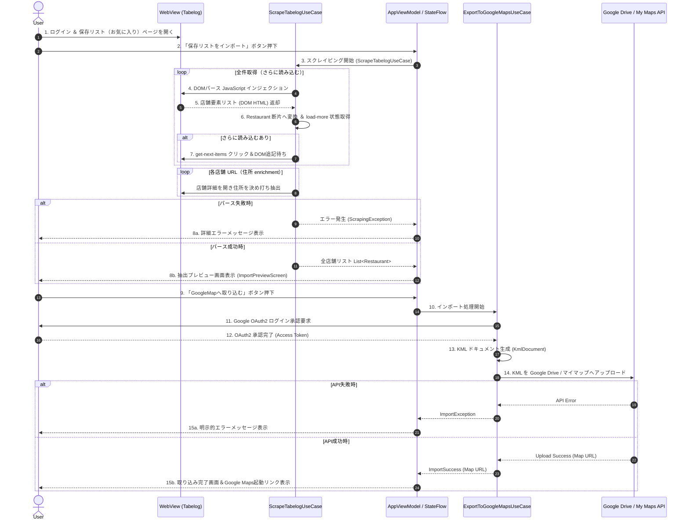
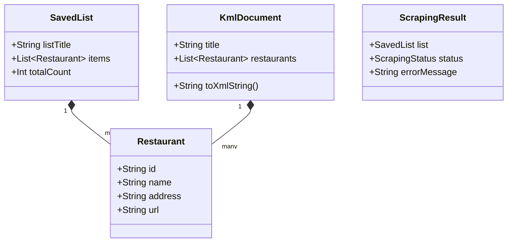

# Sequence and Data Flow Architecture

## 1. Sequence Diagram

The following sequence diagram illustrates the user interaction, multi-page web scraping workflow, domain model transformations, Google OAuth2 authentication, and Google My Maps cloud upload.



---

## 2. Data Flow & Domain Entities

### 2.1. Extraction & My Maps Field Contract

| Domain field | Meaning | My Maps / KML |
| :--- | :--- | :--- |
| `name` | 店舗名 | `<Placemark><name>` |
| `address` | 住所 | `<address>` |
| `url` | 食べログ店舗 URL | `<description>`（URL を description に載せる） |

Out of scope for scrape and KML: rating, genre, phone, notes, personal/account data.

Hardcoded DOM extraction design: [`tabelog-scraping-extraction-spec.md`](./tabelog-scraping-extraction-spec.md).

### 2.2. Domain Model



### 2.3. KML Placemark Mapping (per restaurant)

```xml
<Placemark>
  <name><!-- Restaurant.name --></name>
  <description><![CDATA[
    <!-- Restaurant.url (食べログ URL) -->
  ]]></description>
  <address><!-- Restaurant.address --></address>
</Placemark>
```
