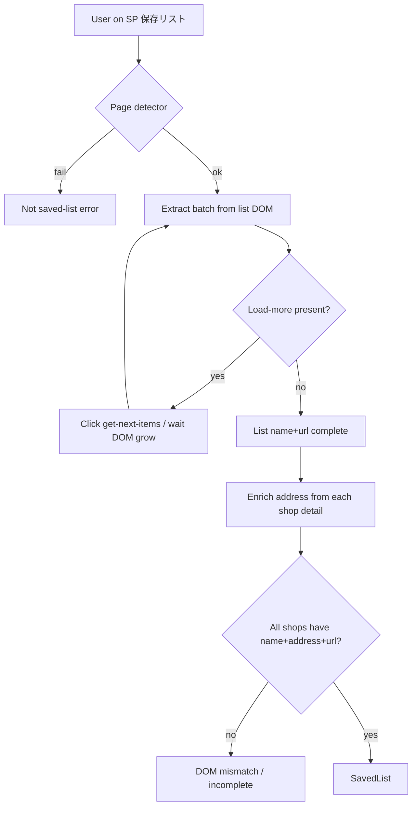

# Tabelog Scraping Extraction Spec & Design

Hardcoded DOM extraction for Tabelog **スマホ版 保存リスト**, including load-more pagination until all shops are collected and address enrichment from shop detail pages.

Related:
- Field contract: [`sequence-and-data-flow.md`](./sequence-and-data-flow.md) §2.1  
- Screens: [`screen-composition-specifications.md`](./screen-composition-specifications.md)  
- Privacy: skills `web-scraping-dom-parsing`, `android-security-privacy`

---

## 1. Design Principles

| Principle | Decision |
| :--- | :--- |
| Strategy | **Selector決め打ち**（固定 CSS／属性のみ） |
| Layout scope | **スマホ版のみ**（WebView は定義された [モバイル UA](#13-user-agent-ua-spoofing) を使用 ＋初期 URL `https://s.tabelog.com/`） |
| Target fields | `name`, `address`, `url` のみ（最終成果物は3フィールド必須） |
| Completeness | 「さらに読み込む」を最後までたどり、**一覧上の全件**を取得する |
| Execution | `WebView.evaluateJavascript` ＋ load-more クリック ＋ 詳細ページでの住所抽出 |
| Failure | 必須欠落・ページャー失敗は明示エラー（空成功・サイレント部分成功なし） |
| Privacy | アカウント／個人情報ノードは読まない・返さない |

---

## 2. Architecture



### 2.1. Layers

| Layer | Responsibility |
| :--- | :--- |
| `TabelogSavedListPageDetector` | スマホ版保存リスト判定 |
| `TabelogDomExtractor` | 現在 DOM から1バッチ分の shop 断片 ＋ load-more 状態 |
| `TabelogPagerController` | `get-next-items` クリックと完了検知 |
| `TabelogAddressEnricher` | 店舗詳細ページから住所を決め打ち取得 |
| `RestaurantHtmlMapper` | JSON → `Restaurant` |
| `ScrapeTabelogUseCase` | 全件ループ、進捗、キャンセル、エラー |

セレクタは `TabelogSelectors.List` / `TabelogSelectors.ShopDetail` に集約する。

---

## 3. Page Detection

### 3.1. URL

Path がスマホ版保存リストであること（例: `/smartphone/reviewer/` かつ `hozon_restaurants`）。  
パス中の reviewer id やニックネームは抽出対象にしない。

### 3.2. DOM

次のいずれか（推奨は併用）:

| Signal | Selector |
| :--- | :--- |
| Cassette | `a.p-bkm-cassette.js-bookmark` |
| Pager | `a.get-next-items` または `#paging_data` |

不一致 → スクレイプ開始不可。

---

## 4. List DOM & Selectors

```
a.p-bkm-cassette.js-bookmark[data-rst-id][href]
  ├─ .p-bkm-cassette__rst-name          → name
  ├─ .p-bkm-cassette__area-genre        → 不使用（エリア/ジャンル。住所ではない）
  └─ href（相対パス可）                 → url（絶対 URL に正規化）
```

| Constant | Selector |
| :--- | :--- |
| `ITEM_ROOT` | `a.p-bkm-cassette.js-bookmark` |
| `NAME` | `.p-bkm-cassette__rst-name` |
| `LOAD_MORE` | `a.get-next-items` |
| `LOAD_MORE_NAV` | `nav.rvw-rst-loading` |
| `PAGING_DATA` | `#paging_data` |

`PAGING_DATA` の `data-item-cnt` / `data-item-perpage` / `data-url` は進捗・完了検証に使ってよい。reviewer 識別子をアプリ永続データとして保存しない。

### 4.1. Fields from list batch

| Field | Source |
| :--- | :--- |
| `name` | `NAME` textContent |
| `url` | `ITEM_ROOT` `href` を絶対化・正規化 |
| `address` | 一覧では取得しない（enrichment 待ち） |

一覧 DOM には番地レベルの住所が無い。

---

## 5. Pagination（「さらに読み込む」・全件必須）

同一文書への追加読み込み。ページ遷移型リンクは使わない。

1. 現在 DOM の全 `ITEM_ROOT` から name+url を抽出して蓄積（url 正規化で dedupe）。  
2. `LOAD_MORE` が存在する間:
   - クリック前の item 数を記録  
   - `LOAD_MORE.click()`  
   - item 数増加または `LOAD_MORE` 消滅まで待機（タイムアウト例: 15s）  
   - settle 後に再抽出  
3. `LOAD_MORE` が無ければ一覧クロール完了。  
4. `#paging_data[data-item-cnt]` があれば最終ユニーク件数と一致することを検証（不一致 → エラー）。  
5. 安全上限（例: 100 回）超過 → エラー。  
6. キャンセル時は部分結果破棄。  

可視テキストには依存せずセレクタ `a.get-next-items` を使う。

---

## 6. Address Enrichment（店舗詳細）

一覧完了後、各 `url` について:

1. 同一 WebView で店舗詳細を開く。  
2. `TabelogSelectors.ShopDetail` で住所テキストのみ取得。  
3. 1件でも住所欠落なら全体失敗（部分インポート禁止）。  

`ShopDetail` セレクタは `app/src/test/resources/...` のテスト HTML と共に管理する。詳細からも電話・アカウント情報は読まない／モデルに載せない。

---

## 7. Exclusions

- タイトル／OG のレビュアー表示名  
- ユーザーメニュー、Tpoint、予約、マイページ  
- CSRF / authenticity token  
- 評価点、口コミ人数、予算  
- エリア／ジャンル（住所の代替にしない）  
- 一覧付帯 JSON を主ソースにしない  

---

## 8. Extractor JSON Contract

```json
{
  "pageValid": true,
  "shops": [
    {
      "id": "{optional-rst-id}",
      "name": "{shop-name}",
      "address": "",
      "url": "{absolute-tabelog-shop-url}"
    }
  ],
  "pager": {
    "type": "load_more",
    "hasLoadMore": true,
    "listedTotalHint": null
  }
}
```

一覧段階の `address` は空でよい。enrichment 後に必須。

---

## 9. Use Case Completion

| Step | Rule |
| :--- | :--- |
| List crawl | load-more が無くなるまで全バッチ |
| Address | 全 url の詳細 enrichment |
| Dedupe | url 正規化 |
| Success | N≥1 かつ全件 name+address+url |
| Progress | 追加読み込み回数＋蓄積件数、続けて enrichment 進捗 |

---

## 10. Error Mapping

| Condition | Error kind |
| :--- | :--- |
| 保存リスト未検出 | Not saved-list |
| cassette ゼロで load-more も無し、件数ヒント>0 | DOM mismatch |
| ネットワーク／タイムアウト | Network |
| load-more 後に件数不増＆コントロール残留 | Pager stall |
| 全クロール後 0 件 | Zero shops |
| listedTotalHint と最終件数不一致 | Incomplete crawl |
| enrichment で住所欠落 | DOM mismatch（detail） |
| load-more 上限 | Crawl limit |

---

## 11. Test & Acceptance

テスト HTML は `app/src/test/resources/` 配下。仕様文面に実在店舗・アカウント固有値を書かない。

| Case | Expect |
| :--- | :--- |
| load-more | クリックごとに件数増加; 最終で `hasLoadMore=false` |
| 一覧 | name+url のみ; area-genre を address にしない |
| enrichment | address 付与後に3フィールド充足 |
| 除外 | 評価・ジャンル・アカウント情報がモデルに出ない |

---

## 12. Maintenance

1. 一覧または詳細のマークアップ変更時は該当セレクタ表とテストを同時更新する。  
2. ページャーは load-more のみを前提とする。  

---

## 13. User Agent (UA) Spoofing

タブレット端末やデスクトップ環境で WebView を使用する場合でも、確実にスマホ版レイアウト（`s.tabelog.com`）を表示させるため、以下の UA 文字列を強制的に適用する。

### 13.1. Recommended UA String

```text
Mozilla/5.0 (Linux; Android 10; K) AppleWebKit/537.36 (KHTML, like Gecko) Chrome/130.0.0.0 Mobile Safari/537.36
```

### 13.2. Requirements

- **Mobile Token**: `Mobile` トークンが必須。これが無いとタブレット版やPC版が返され、DOM セレクタが不一致となる。
- **Reduced UA Format**: Chrome の UA 削減方針（Android バージョンとモデルの固定化）に準拠し、`Android 10; K` を使用する。
- **Major Version**: 安定したメジャーバージョン（例: `130`）を指定し、マイナーバージョンは `.0.0.0` とすることで標準的なブラウザの振る舞いを模倣する。

